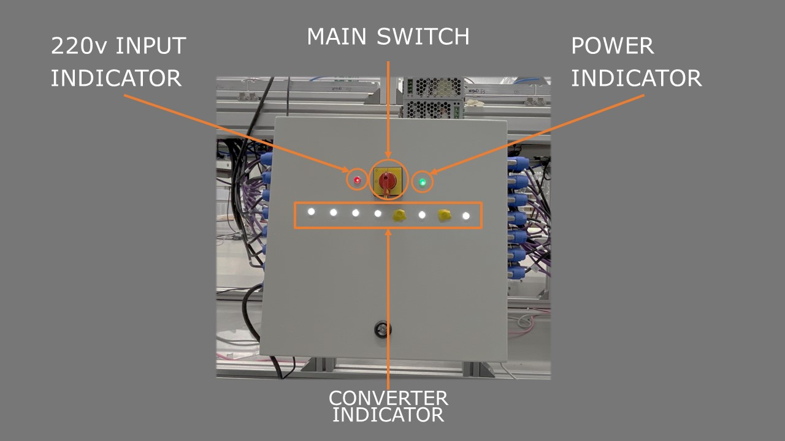

<div align="center">

# Main Row
This folder include the main row electrical wiring, network configuration, and row master HMI software. 

</div>

<!-- ########################################################################################### -->
<!--                                     # Table of Contents                                     -->
<!-- ########################################################################################### -->
<div align="center">

# Table of Contents
</div>

- [Main Row](#main-row)
- [Table of Contents](#table-of-contents)
- [Getting Started](#getting-started)
    - [Front Panel](#front-panel)
    - [Internal Component](#internal-component)
    - [⚠️Common Faults](#️common-faults)
- [Installation](#installation)
  - [Network Configuration](#network-configuration)
    - [Network Plan Diagram](#network-plan-diagram)
    - [Router configuration](#router-configuration)
    - [IP table](#ip-table)
    - [WiFi Information](#wifi-information)
  - [Electrical Wiring](#electrical-wiring)
    - [BOM](#bom)
    - [Power Rating](#power-rating)
  - [HMI](#hmi)
    - [Streamlit UI](#streamlit-ui)
    - [Logic Flow Diagram](#logic-flow-diagram)


<!-- ########################################################################################### -->
<!--                                      # Getting Started                                      -->
<!-- ########################################################################################### -->
<div align="center">

# Getting Started
</div>


<!-- ===================================== ### Front Panel ===================================== -->
### Front Panel 


<!-- ================================= ### Internal Component ================================== -->
### Internal Component


<!-- =================================== ### ⚠️Common Faults =================================== -->
### ⚠️Common Faults
- ⚠️Streamlit UI does not start
  > ssh connect to row master via ```linaro@rowmaster0x0001```, password: ```linaro```
  > ``` bash
  > sudo systemctl restart webapp.service
  > ``` 

- ⚠️ Auto pot filling (***Overflow***)
  > In the UI
    > 1. Press ```STOP 1A```
    > 2. Press ```SET ZERO```   
  
  > Access to Duet, i.e. Pot Dispenser *default IP: 192.168.83.102* 
    > 1. Execute marcos ```homing```
  
  > In the UI
    > 1. Press ```START 1A```

- ⚠️ Auto pot filling (***Underflow***)
  >  In the UI
    >   1. Press ```Add 10 Pots```


<!-- ########################################################################################### -->
<!--                                       # Installation                                        -->
<!-- ########################################################################################### -->
<div align="center">

# Installation
</div>

<!-- ================================ ## Network Configuration ================================= -->
## Network Configuration
The module 1 is a self-subnet system which **IS NOT A MUST** to have external nextwork connection. However, the cages require internet to update files to **AWS** and update data to **MongoDB**. The network plan diagram shown below.

<!-- ### Network Plan Diagram -->
### Network Plan Diagram
<div align="center">

 
</div>

<!-- ### Router configuration -->
### Router configuration
```
URL: 192.168.83.1
PWD: bigsisRouter
```
<!-- ### IP table -->
### IP table
<div align="center">

|                  Name |       IP       |                               Remark                               |
| --------------------: | :------------: | :----------------------------------------------------------------: |
|               Gateway |  192.168.83.1  |                 The router itself and the backend                  |
|    Duet - Diet heater | 192.168.83.99  |        The duet control board for the diet chamber heating         |
|     Duet - Pot Sorter | 192.168.83.100 |             The duet control board for the Pot Sorter              |
| Duet - Diet Dispenser | 192.168.83.101 |           The duet control board for the Diet Dispenser            |
|  Duet - Pot Dispenser | 192.168.83.102 |            The duet control board for the Pot Dispenser            |
| Duet - Chimney Sorter | 192.168.83.103 |           The duet control board for the Chimney Sorter            |
| Duet - Chimney Placer | 192.168.83.104 |       The duet control board for placing chimney on the pot        |
|          cage0x00[??] | 192.168.83.??? | the cages ip is based on DHCP, use the **hostname** for connection |

</div>

<!-- ### WiFi Information -->
### WiFi Information
<div align="center">

| SSID       | Bandwidth | PSW       |
| :--------- | :-------- | :-------- |
| MPU        | 2.4GHz    | bigsisMPU |
| MPU-bigsis | 5GHz      | bigsisMPU |
</div>

<!-- ================================== ## Electrical Wiring =================================== -->
## [Electrical Wiring](2.1%20Wiring%20Diagram/)

<!-- ### BOM -->
### BOM
<div align="center">

| Index |           items           |  Qty  |                            URL                             |
| ----: | :-----------------------: | :---: | :--------------------------------------------------------: |
|     1 |         NAC3-FC-A         |   1   |               [Amazon](https://rb.gy/uictc6)               |
|     2 |         NAC3-MP-A         |  14   |               [Amazon](https://rb.gy/s266sl)               |
|     3 |       Hager ADA316G       |   1   |               [Amazon](https://rb.gy/d40zoy)               |
|     4 |       220v RED LED        |   1   |               [Amazon](https://rb.gy/9rw74b)               |
|     5 |      220v GREEN LED       |   1   |               [Amazon](https://rb.gy/kq1ddi)               |
|     6 |     12v-24v WHITE LED     |   6   |               [Amazon](https://rb.gy/8cjexb)               |
|     7 |   Mean Well EDR-120-12    |   6   | [MeanWell](https://www.meanwell.com/productPdf.aspx?i=136) |
|     8 | GL.iNet GL-SFT1200 Router |   1   |               [Amazon](https://rb.gy/op9ojh)               |
|     9 |  TP-Link 16-Port Switch   |   1   |               [Amazon](https://rb.gy/7cygw7)               |
</div>

<!-- ### Power Rating -->
### Power Rating
The maximum power consumion of each cage is ***18W***. \
The condition is listed below 
<div align="center">

|                             Name | Remark                        |
| -------------------------------: | :---------------------------- |
| Cross-Polarizing Lighting System | ON                            |
|                   Optical Sensor | THREE UNITS ARE INSTALLED     |
|                           Servos | Running sequentially          |
|                           Tinker | Running RKNN and applications |

</div>


<!-- ========================================= ## HMI ========================================== -->
## [HMI](2.2%20Software/)
<!-- ### Streamlit UI -->
### Streamlit UI


<!-- ### Logic Flow Diagram -->
### Logic Flow Diagram
The row master human-machine-interface (HMI) is developed under ***Python*** and ***Streamlit 1.8*** framework. The logic flow diagram is listed below.


<!-- ------------------------------------------------------------------------------------------- -->