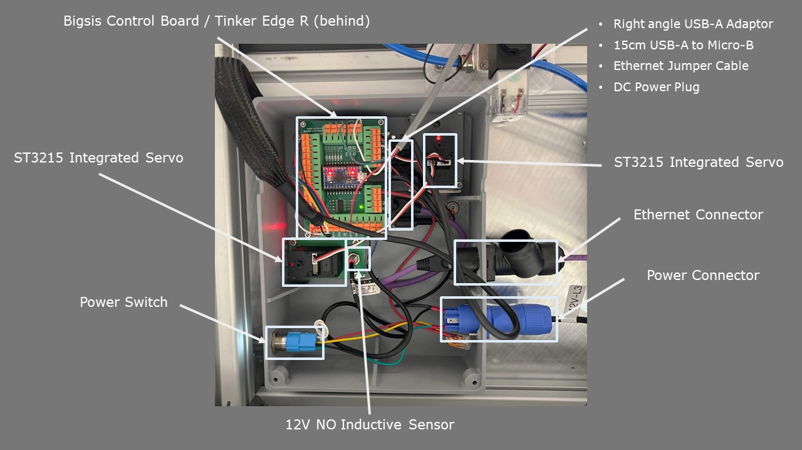

# BigSis Smart Cage system
The main Controller Board (Tinker/Rock/RaspberryPi) application is developed in Python for the backend and React Js for the frontend. 

## **Folder Structure**
```terminal
Computer
│
├── src
│   ├── BscbAPI             
│   │   ├── __init__.py             
│   │   └── BscbAPI.py                  // BigSis Control Board API (to communicate with arduino)
│   ├── CLI                             // For terminal printing
│   │   └── __init__.py
│   ├── cloud                           // Data upload to MongoDB
│   │   └── __init__.py
│   ├── comm
│   │   ├── __init__.py
│   │   └── sensor.py
│   ├── data                            // Shared Variables
│   │   └── __init__.py
│   ├── operation                       // Different modes for production
│   │   └── __init__.py
│   ├── setup                           // System config/constant parameters
│   │   ├── __init__.py
│   │   └── DEFAULT.ini                 // Configuration file
│   ├── tasks                           // Background loops
|   │   ├── react app                   //front-end in react Javascript
│   │   │   └── build
│   │   ├── aws                         // AWS cloud service for image upload to S3 bucket
│   │   │   └── __init__.py
│   │   ├── camera                      // USB camera handler
│   │   │   └── __init__.py
│   │   ├── check_alignment             // check SW alignment (not in use)
│   │   │   └── __init__.py
│   │   ├── find_circle                 // Function to mask out everything but the pot
│   │   │   └── __init__.py
│   │   └── httpServer                  // HTTP Server with flask 
│   │       ├── __init__.py
│   │       ├── httpGetHandler.py       //get request
│   │       └── httpPostHandler.py      //post request
│   └── vision                          // AI with YOLO models
│       ├── __init__.py
│       └── prediction.py               // YOLO processing functions
│
└── main.py                             // Main file
```

## **Cage UI**


### Production Status
- **Mode:** Displays the operation mode in which the cage is running.
- **Status:** Indicates the cage status. If everything is functioning normally, it will display 'normal'. Otherwise, it will show an error, a warning, or an action that needs to be performed.


### Commands
**Note:** These buttons are disabled if the cage is in production mode.
- ↪️ **Step SW Anti-clockwise:** Moves the SW anti-clockwise.
- ↩️ **Step SW Clockwise:** Moves the SW clockwise.
- ⤵️ **Eject Pot:** Ejects the pot.


### Servos Init
**Note:** These buttons are disabled if the cage is in production mode.
- **ALL INIT:** This command clears any servo errors first, then retracts the pot unloader to the homing position if it's not already there. Following this, the starwheel will move clockwise until the starwheel homing sensor is triggered.


### SW Alignment
**Note:** These buttons are disabled when the cage is operating in production mode. They are specifically designed for precisely aligning the pot within the hole. Follow the steps outlined below to ensure proper alignment:
- **Save Zero:** Resets the StarWheel (SW) offset to zero. This action establishes a baseline reference point for alignment adjustments.
- **Move SW:** Adjusts the SW to a new position based on the input value provided adjacent to the 'Move SW' button. Experiment with different offset values to align the pot slot accurately with the camera hole.
- **Save Offset:** Once the optimal offset is achieved, use this option to permanently save the adjustment, ensuring consistent alignment in future operations.


### Experiment Settings
- **Set Interval:** This command configures the static time for the cage when it is in 'Experiment' mode.
- **Set Cycle Time:** This command configures the maximum allowable time to complete a full cycle for one pot, which includes capturing the image, applying AI prediction, saving or uploading data, and moving the servos.
- **Set Valve Delay:** This command configures the duration of the air pulse emitted into the cage.


### Servos & Sensors
This section visualizes the status of key components: the StarWheel (SW), unloader, buffer sensor, and load sensor through icons.

- **Gear Icons:** 
  - **Green:** Indicates that the components are functioning correctly.
  - **Red:** Signals an overload condition in the servos.
  - **Black:** Shows that the component is disconnected.
  - **Grey:** Appears immediately after a system restart, indicating that the components are initializing. The progression to an initialized state will be reflected in the 'status' under the production 'Production Status'.

- **Sensor Icons:** 
  - **Green:** Active when sensors are successfully triggered.

**Important Note:** In production mode, if the sensors are not triggered for any reason, the servos will not operate until the sensors are triggered again, ensuring safe and accurate operation of the cage.


### Operation Control
This section outlines the operational modes available for controlling the processes within the cage:
- **PNP:** This mode operates continuous processing of pots. It includes capturing images, running AI detection to identify eggs, ejecting pots where eggs are detected, advancing the StarWheel (SW) by one slot, and saving/uploading data.
- **DUMMY:** This simplified mode does not utilize AI detection and automatically ejects every other pot by default. The frequency of ejection can be adjusted as needed.
- **EXPERIMENT:** This mode mirrors the PNP operations for 80 pots, involving processes such as image capture, AI detection, ejection based on egg detection and saving/uploading data. After processing 80 pots, the system enters a static operation phase. The cycle then repeats, alternating between active processing and static phases. The duration of each static phase can be adjusted using the 'Set Interval' button.

## **Hardware Installation**



## **Wiring**


